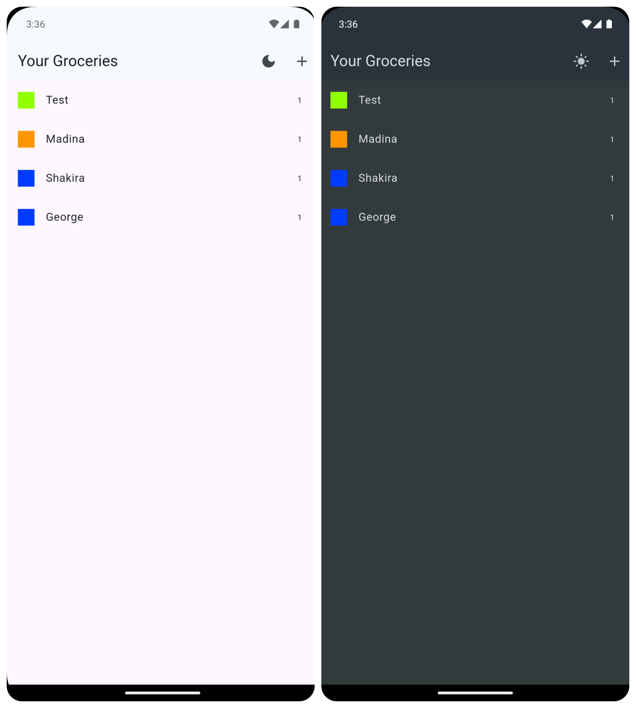

# Shopping List

A simple Flutter app to manage your shopping list. This project demonstrates a clean UI with Material 3 support, featuring dynamic theme switching (system, dark, and light mode) along with the core functionality to add, update, and remove grocery items.

## Features

- **Add Items:** Quickly add new items to your shopping list.
- **Update Items:** Edit details of existing items.
- **Delete Items:** Remove items using swipe-to-delete.
- **Dynamic Theme Switching:** Supports system theme, with a dark/light mode toggle built into the app.
- **Modern UI:** Built with Material 3 and a dark theme design.
- **Networking:** Fetches and updates data with Firebase Realtime Database.

## Tech Stack

- **Flutter (Dart)**
- **Material Design 3**
- **HTTP:** For network requests.
- **Firebase Realtime Database:** For data storage.
- **State Management:** setState

## Screenshots



## Getting Started

### Prerequisites

- [Flutter SDK](https://flutter.dev/docs/get-started/install)
- A connected emulator or physical device.

### Installation

1. **Clone the repository:**

   ```bash
   git clone https://github.com/iamvedantp/contact_list.git
   cd contact_list

   ```

2. **Install dependencies:**

   ```bash
   flutter pub get

   ```

3. **Run the app:**
   ```bash
   flutter run
   ```

#### Project Structure

lib/
├── main.dart # App entry point; handles theme switching.
├── widgets/
│ ├── grocery_list.dart # Main screen for displaying grocery items.
│ └── new_item.dart # Screen for adding a new grocery item.
├── models/
│ ├── category.dart # Defines the Category model.
│ └── grocery_item.dart # Defines the GroceryItem model.
└── data/
├── categories.dart # Contains available categories.
└── dummy_items.dart # Dummy data for testing.

## Future Improvements

- Persistent Storage: Save data locally using Shared Preferences or SQLite.
- Search Functionality: Add search and filter capabilities.
- Enhanced UI/UX: Improve animations and transitions.
- User Authentication: Integrate user accounts for personalized lists.
- Cloud Sync: Synchronize lists across devices via Firebase.

# Contributing

Contributions are welcome! To contribute:

1. Fork the repository.
2. Create a new branch (git checkout -b feature-branch).
3. Commit your changes (git commit -m "Your message").
4. Push to your branch (git push origin feature-branch).
5. Open a pull request.

# License

This project is licensed under the MIT License. See the LICENSE file for details.
